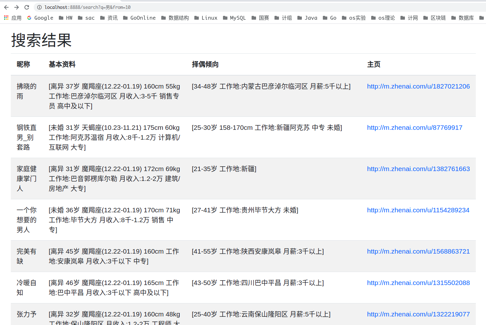

本爬虫爬取了珍爱网所有城市第一页用户的信息。信息存储在docker运行的elasticsearch。

开发流程：单任务版->并发版->分布式版。

### Run

用docker跑elasticsearch，版本号需要根据自己的docker进行修改：

```
docker run -d -p 9200:9200 -p 9300:9300 -e "discovery.type=single-node" elasticsearch:7.11.1
```

#### 并发版爬虫

直接运行single下的main.go以及resources中的main.go。

#### 分布式版爬虫

例如，开一个存储server和三个爬虫server：

```go
// 开存储server
cd ./distributed/persist/server
go run itemsaver.go --port=1234

// 开爬虫server，数量任意
cd ./distributed/worker/server
go run worker.go --port=9000 
go run worker.go --port=9001 
go run worker.go --port=9002

// 开爬虫client
 go run main.go -itemsaver_host=":1234" -worker_hosts=":9000,:9001,:9002" 
```

### 结果

搜索结果如下，实际上，爬取的数据种类比前端显示出来的更多，但是前端不是本项目的重点(所以就随便整整得了吧)。

